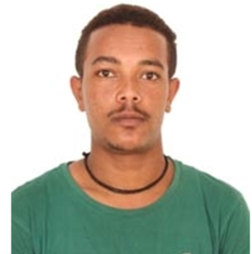

{width=400px style="float: left; margin-left: 0px;margin-right: 20px; margin-bottom: 10px;"}

### Bio
Addisu is a curious mind at the intersection of engineering and medicine. He holds a Bachelor's degree in Electronics & Communication Engineering and Biomedical Engineering from Vellore Institute of Technology (2018-2022) and a Master's degree in Data Science from the Skolkovo Institute of Science and Technology (2023-2026). Fascinated by the complexity of the human body and the power of data, he builds machine learning solutions for biomedical problems: from medical image analysis to disease prediction. He believes in the transformative potential of AI in healthcare and is always eager to learn, experiment, and collaborate.

###Skills:   
 🟤 Machine Learning & Deep Learning: PyTorch, TensorFlow, Scikit-learn, JAX
 🟤 Biomedical Data Analysis: Medical Image Analysis, Feature Extraction, Signal Processing
 🟤 Programming: Python (Expert), MATLAB, SQL, C++
 🟤 Software Engineering: FastAPI, Docker, Git, MLflow, Kubernetes
 🟤 Data Pipelines: End-to-end ML pipelines, Data Engineering, ETL
 🟤 Statistical Methods: Bayesian Methods, Optimization, Cross-validation

### Contact

- **email:** amareaddisu5@gmail.com
- **LinkedIn:** [profile](https://www.linkedin.com/in/addisu-amare-27/)
